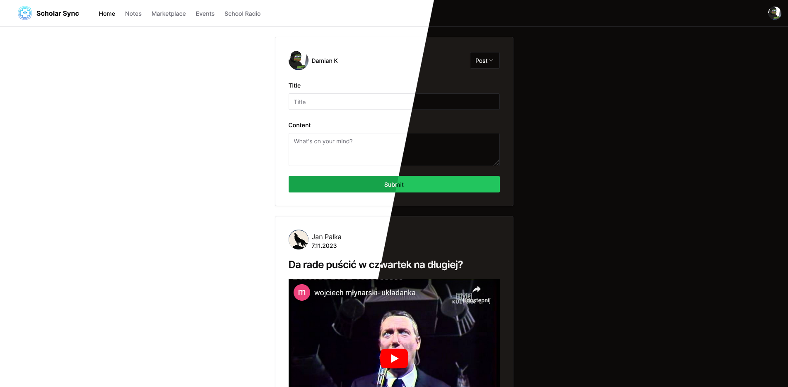

# ScholarSync

Scholar Sync is an application that combines features from various disconnected applications, enriching them with new functionalities. This integration simplifies and enhances time and school life management for both students and teachers.

## Screenshots



## Tech Stack

- [NextJS](https://nextjs.org/)
- [ReactJS](https://react.dev/)
- [Typescript](https://www.typescriptlang.org/)
- [Tailwindcss](https://tailwindcss.com/)
- [Postgresql](https://www.postgresql.org/)

## Features

Our application offers a range of useful features:

- Notes Section: Users can create, edit, and store notes effortlessly. The intuitive interface allows students and teachers to manage their educational materials effectively. The "Notes" section supports multimedia attachments, including images, audio files, and videos, aiding in better information delivery and comprehension.

- Spotted Section: This central part of the application enables students to publish diverse content such as announcements, events, polls, and commercial offers. It encourages interaction among students, allowing them to comment and react to posts, fostering better communication and exchange of opinions within the community. The feature promotes collaboration by facilitating the sharing of ideas and projects.

- Radio Node: Students can add their favorite music tracks to the school radio station, influencing the musical program in the school. They can share songs by providing links to music streaming sources. This functionality promotes musical creativity and diversity in the school, enabling active student participation in creating music for the school radio.

- Marketplace: Users can post education-related advertisements, offer tutoring services, and buy/sell or exchange educational materials like books and textbooks. The search functionality simplifies browsing available offers, promoting knowledge exchange and saving costs on essential materials. It creates a more integrated educational environment.

## Roadmap

### We have exciting ideas to further improve the application, including:

- Anonymous posts
- Voting for songs on the school radio
- Sorting posts and notes

### Implementation and Collaboration

The simplicity of the technologies used makes the application easy to implement for any interested school. While schools are the primary target, modifications can allow implementation in various businesses, expanding the pool of potential partners and collaborators.

Scholar Sync significantly enhances students' lives by providing a platform that promotes effective learning, communication, and collaboration. With its intuitive features and potential for future enhancements, Scholar Sync is poised to create a more connected and interactive educational community.

## Environment Variables

To run this project, you will need to add the following environment variables to your .env file

- `DATABASE_URL` Postgresql database url
- `GOOGLE_CLIENT_ID`, `GOOGLE_CLIENT_SECRET` [Google OAuth 2.0 Client ID](https://cloud.google.com/docs/authentication?hl=en_GB)
- `UPLOADTHING_SECRET` [uploadthing](https://uploadthing.com/) app secret for file upload

## Run Locally

Clone the project

```bash
git clone https://github.com/DamianKocjan/ScholarSync.git
```

Go to the project directory

```bash
cd my-ScholarSync
```

Install dependencies

```bash
npm install
```

Fill environment variables in `.env` file

Start application

```bash
npm run dev
```

## Authors

- [Jan Pałka](https://www.github.com/GeneralKartoniarz)
- [Damian Kocjan](https://www.github.com/DamianKocjan)

## License

[MIT](https://github.com/DamianKocjan/ScholarSync/blob/main/LICENSE)
